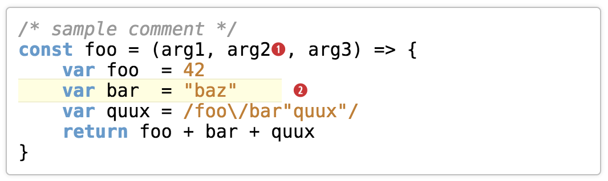

Syntax
======

Unobtrusive Syntax Highlighting Library

<p/>


<p/>




About
-----

Syntax is JavaScript library (for use in Node.js and Browser
environments) to apply Syntax Highlighting to a piece of input text --
usually source code. Syntax is based on four major design aspects:

- **Good Language Support**:
  The language-specific determination of comments, keywords and
  literals should be a reasonable one. As syntax highlighting
  is a science of its own, Syntax under the hood uses the excellent
  [Highlight.js](https://highlightjs.org/) library.

- **Unobtrusive Syntax Highlighting**:
  The author, Ralf S. Engelschall, is a die-hard coder with a very
  strict opinion when it comes to source code. One of his opinions is
  that syntax highlighting has to be as unobstrusive as possible and
  hence should highlight comments, keywords, and literals only. As a
  consequence, Syntax intentionally(!) reduces the syntax highlighting
  of the underlying [Highlight.js](https://highlightjs.org/) to just
  these three kinds of syntactical elements.

- **Anchors and Markers**:
  In technical documentation it is regularily necessary to mark
  arbitrary pieces of code and interspice reference anchors.
  Unfortunately, whatever syntax is used for marking and anchors, this
  always conflicts with the language-dependent syntax highlighting
  as the marking and anchors renders the source code invalid. Syntax
  resolves this problem by first reducing the (rich) input text to plain
  text (by removing markings and anchors) and reapplying the markings
  and anchors during output generation.

- **Arbitrary Output Formats**:
  Usually, having XML/HTML output format is sufficient, but sometimes
  one also wants to support other formats and for this one needs the
  precise offset information for anchors, markings, comments, keywords
  and literals. Syntax supports this by internally using such an offset
  based markup information and also exposing it in the API for external
  consumption.

Installation
------------

#### Node environments (with NPM package manager):

```shell
$ npm install syntax
```

#### Browser environments (with Bower package manager):

```shell
$ bower install syntax
```

Example
-------

```js
import Syntax from "syntax"

let syntax = new Syntax({
    language: "javascript",
    cssPrefix: ""
})

syntax.richtext(
    "/* sample comment */\n" +
    "={function foo}= (bar, quux) {\n" +
    "    return 42 =(1)=\n" +
    "}\n"
)

console.log(syntax.plaintext())
// +--- output: ---------------------------
// | /* sample comment */\n
// | function foo (bar, quux) {\n
// |     return 42 \n
// | }\n
// +---------------------------------------

console.log(require("util").inspect(syntax.markup(), { depth: null }))
// +--- output: ---------------------------
// | { anchor:  { '1': 62 },
// |   marker:  [ [ 21, 33 ] ],
// |   comment: [ [ 0, 20 ] ],
// |   keyword: [ [ 21, 29 ], [ 52, 58 ] ],
// |   literal: [ [ 59, 61 ] ] }
// +---------------------------------------

console.log(syntax.html())
// +--- output: ---------------------------
// | <span class="comment">/* sample comment */</span>\n
// | <span class="keyword"><span class="marker">function</span></span><span class="marker"> foo</span> (bar, quux) {\n
// |     <span class="keyword">return</span> <span class="literal">42</span> <span class="anchor anchor-1"></span>\n
// | }\n
// +---------------------------------------
```

Application Programming Interface (API)
---------------------------------------

### Class `Syntax`

- Constructor: `Syntax(config?: Object): Syntax`<br/>
  Create a new syntax highlighting instance with
  optional configuration settings.

- Method: `Syntax#config(config?: Object): Syntax`<br/>
  Set configuration settings. The available configuration options are:

   - `language` (default: `"auto"`):<br/>
     Control the syntax highlighting of comments, keywords and literals.
     By default, the language is guessed. See below for recognized
     language identifiers. Set to `"none"` to enforce no syntax
     highlighting of comments, keywords and literals at all (then
     just markings and anchors are recognized).

   - `cssPrefix` (default: `"syntax-"`):<br/>
     The CSS class prefix used in the HTML output.

   - `tabReplace` (default: `"    "`):<br/>
     The string TAB characters are replaced to in the output.

   - `newlineReplace` (default: `"\n"`):<br/>
     The string newlines (`\r?\n`) are replaced to in the output.

   - `regexAnchorOpen` (default: `"=\\("`):<br/>
     The regular expression (as a string) to recognize the opening of anchors.
     Remember to extra-escape the special characters and to pass this as a
     string, as Syntax internally has to assemble the regular expressions.

   - `regexAnchorClose` (default: `"\\)="`):<br/>
     The regular expression (as a string) to recognize the closing of anchors.
     Remember to extra-escape the special characters and to pass this as a
     string, as Syntax internally has to assemble the regular expressions.

   - `regexMarkerOpen` (default: `"=\\{"`):<br/>
     The regular expression (as a string) to recognize the opening of markings.
     Remember to extra-escape the special characters and to pass this as a
     string, as Syntax internally has to assemble the regular expressions.

   - `regexMarkerClose` (default: `"\\}="`):<br/>
     The regular expression (as a string) to recognize the closing of markings.
     Remember to extra-escape the special characters and to pass this as a
     string, as Syntax internally has to assemble the regular expressions.

- Method: `Syntax#richtext(input: String): Syntax`<br/>
  Set the rich input text to process.

- Method: `Syntax#plaintext(): String`<br/>
  Method: `Syntax#plaintext(plaintext: String): Syntax`<br/>
  Get or set the plain (output) text (the rich text after removing explicit markers and anchors).
  The plain text is updated when `richtext()` is called. If using a custom
  markup information it can be also set manually.

- Method: `Syntax#markup(): Markup`<br/>
  Method: `Syntax#markup(markup: Markup): Syntax`<br/>
  Get or set the markup information. The markup information is updated
  when `richtext()` is called. But a custom markup information can
  be provided manually, too. The format of the markup information is:

    ```
    {
        anchor:  {
            <reference: String>: <position: Number>
            :
        },
        marker: [
            [ <start-position: Number>, <end-position: Number> ]
            :
        ],
        comment: [
            [ <start-position: Number>, <end-position: Number> ]
            :
        ],
        keyword: [
            [ <start-position: Number>, <end-position: Number> ]
            :
        ],
        literal: [
            [ <start-position: Number>, <end-position: Number> ]
            :
        ]
    }
    ```

  The positions are zero-based and end positions are at the first
  character not included in the range.

- Method: `Syntax#html(): String`<br/>
  Apply the output markup information onto the output plain text and
  render the result as XML/HTML based on interweaved `<span>` tags.

Language Support
----------------

By default, Syntax supports the following major languages (with the
`language` configuration option identifiers in parenthesis):

1. Web Technology Languages: XML/HTML (`xml`), CSS (`css`), LESS
   (`less`), HTTP (`http`), JSON (`json`), INI `ini`, MarkDown (`markdown`),
   SQL (`sql`).

2. Progamming Languages: C/C++ (`cpp`), Objective-C (`objectivec`),
   Swift (`swift`), C# (`cs`, `csharp`), F# (`fsharp`), Go (`go`), Java
   (`java`), Groovy (`groovy`), Scala (`scala`), JavaScript (`js`,
   `javascript`), TypeScript (`typescript`), PHP (`php`), Perl (`perl`),
   Python (`python`), Ruby (`ruby`).

3. Shell Languages: Bash (`bash`), PowerShell (`powershell`).

Those languages are pre-loaded in Node.js and bundled
with Syntax in the browser. In Node.js more languages
can be auto-loaded by just setting the `language`
configuration to its official identifier. See [Highlight.js'
sources](https://github.com/isagalaev/highlight.js/tree/master/src/langu
ages) for the identifiers (it is just the filename without the `.js`
extension). In browser environments, auto-loading additional languages
obviously does not work. There you have to bundle the additional
languages youself and call `hljs.registerLanguage()` yourself.

Implementation Notice
---------------------

Although Syntax is written in ECMAScript 6, it is transpiled to ECMAScript
5 and this way runs in really all(!) current (as of 2015) JavaScript
environments, of course.

License
-------

Copyright (c) 2015 Ralf S. Engelschall (http://engelschall.com/)

Permission is hereby granted, free of charge, to any person obtaining
a copy of this software and associated documentation files (the
"Software"), to deal in the Software without restriction, including
without limitation the rights to use, copy, modify, merge, publish,
distribute, sublicense, and/or sell copies of the Software, and to
permit persons to whom the Software is furnished to do so, subject to
the following conditions:

The above copyright notice and this permission notice shall be included
in all copies or substantial portions of the Software.

THE SOFTWARE IS PROVIDED "AS IS", WITHOUT WARRANTY OF ANY KIND,
EXPRESS OR IMPLIED, INCLUDING BUT NOT LIMITED TO THE WARRANTIES OF
MERCHANTABILITY, FITNESS FOR A PARTICULAR PURPOSE AND NONINFRINGEMENT.
IN NO EVENT SHALL THE AUTHORS OR COPYRIGHT HOLDERS BE LIABLE FOR ANY
CLAIM, DAMAGES OR OTHER LIABILITY, WHETHER IN AN ACTION OF CONTRACT,
TORT OR OTHERWISE, ARISING FROM, OUT OF OR IN CONNECTION WITH THE
SOFTWARE OR THE USE OR OTHER DEALINGS IN THE SOFTWARE.

